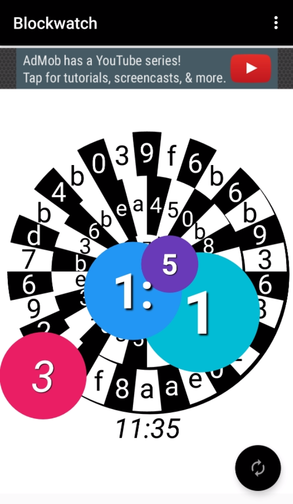

# Capstone-Project
Final App for Udacity Course - Blockchain watch

BlockWatch tells the time on your phone and/or Android Wear device by transforming the latest transaction hashes from the BitCoin blockchain in a visually compelling way, powered by the Blockchain.info API.

The app will appeal to all of those who really grok everything Bitcoin and blockchain related (like me!) and want an accessory that is connected to real-time Bitcoin data.

